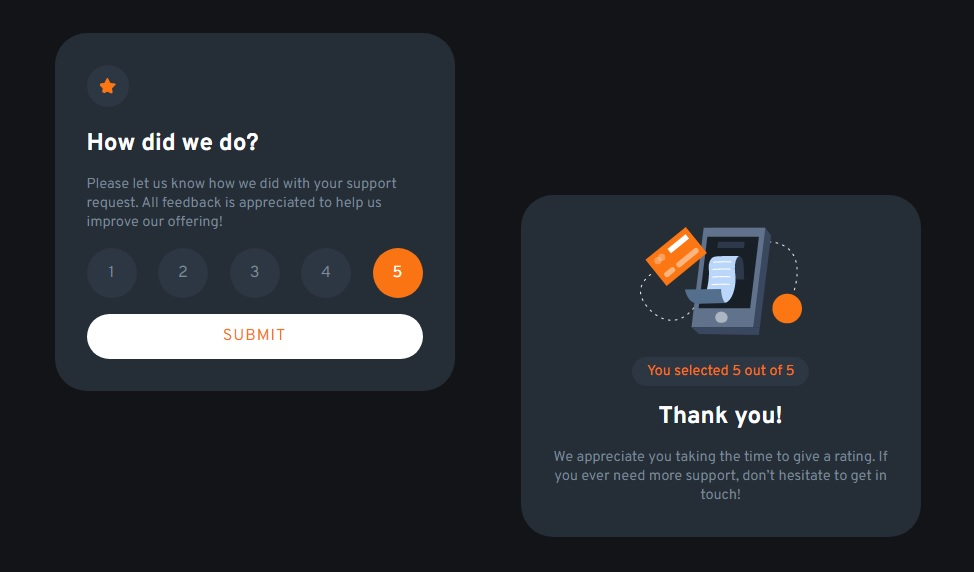

# Frontend Mentor - Interactive rating component

## 🖥️ O Projeto
Esse é um protótipo Web Responsivo para exibir a nota definida sobre um serviço ou produto.
 

## 🚀 Tecnologias
Esse protótipo foi desenvolvido com as seguintes tecnologias:

- HTML5
- CSS3
- JS
- Git e Github